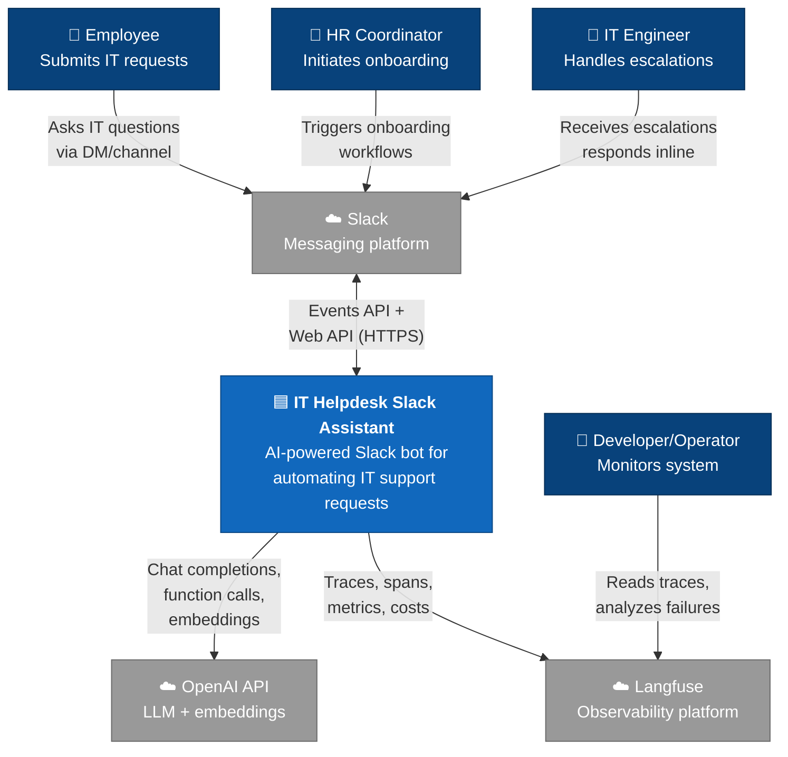
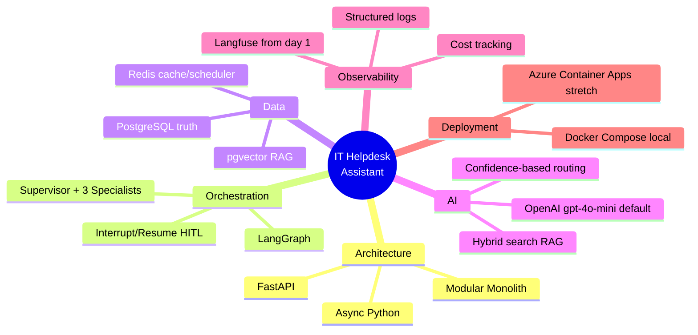

# Solution Design Document: IT Helpdesk Slack Assistant

## 1. Introduction & Goals
## 2. Architecture Constraints
## 3. Context & Scope
## 4. Solution Strategy
## 5. Building Block View (C4 levels)
## 6. Runtime View (Sequence Diagrams)
## 7. Deployment View
## 8. Cross-cutting Concerns
## 9. Architecture Decisions


# Solution Design Document: IT Helpdesk Slack Assistant

**Version:** 1.0
**Date:** 2026-05-13
**Status:** Draft for capstone review
**Related documents:** [Project Charter](./01-project-charter.md)

---

## 1. Introduction & Goals

### 1.1 Purpose
Questo documento descrive Tecnical solution per IT Helpdesk Slack Assistant -
un sistema integrata con Slack e basato su AI che automatizza le richieste 
di supporto IT di routine e inoltra in modo intelligente le richieste complesse o critiche agliu ingegneri IT umani

Per il contesto aziendale, la dichiarazione del problema e l'ambito del progetto, vedere li [Project Charter](./01-project-charter.md).

### 1.2 Quality Goals

I seguenti attributi di qualita guidano le decisioni architettoniche, in ordine di priorita:

| Priority | Quality Goal | Motivation |
|---|---|---|
| 1 | **Defendability** | Ogni decisione architettonica deve essere giustificabile in sede di revisione tecnica |
| 2 | **Correctness of agent behavior** | Le azioni errate(ad esempio concedere un acesso non autorizzato) hanno un costo maggiore rispetto alle aumazione mancate |
| 3 | **Observability** | I flussi di agenti a più fasi devono essere debuggabili end-to-end |
| 4 | **Iterability** | The system must support adding new agents, tools, and flows without redesign |
| 5 | **Operational simplicity** | Progetto con un solo sviluppatore — un numero ridotto di componenti è preferibile alla sofisticazione di un'architettura distribuita |

### 1.3 Stakeholders

| Stakeholder | Expectations from this document |
|---|---|
| Revisore del Capstone | Verificare il ragionamento architetturale e la sua profondità |
| Sviluppatore (se stesso) | Riferimento per l'implementazione e la difesa |
| Futuro manutentore | Comprendere il sistema senza dover ricostruire le decisioni |

## 2. Architecture Constraints

### 2.1 Technical Constraints

| Constraint | Source | Impact |
|---|---|---|
| Ecosistema Python 3.11+ | Scelta dello stack | Tutti i componenti devono avere un supporto maturo per Python |
| Progettazione async-first | Pattern di FastAPI + LangGraph | I client del database e HTTP devono essere asincroni (asyncpg, httpx, slack-sdk async) |
| OpenAI come provider LLM | Scelta dello stack | Il sistema tollera una dipendenza esterna per le funzionalità di AI |
| Singola unità distribuibile (inizialmente) | Ambito del progetto | Nessun microservizio, nessun coordinamento distribuito nella v1 |
| pgvector per gli embedding | Scelta dello stack | Vector store collocato insieme ai dati relazionali; si accetta il compromesso rispetto a vector DB specializzati |

### 2.2 Organizational Constraints

| Constraint | Source | Impact |
|---|---|---|
| Sviluppatore unico | Contesto del progetto | Evitare architetture che richiedono una specializzazione del team (ad es. ruoli separati per ML/backend) |
| Tempistica di 10–14 giorni | Project Charter | Riduzione dell'ambito anziché diluizione del design in caso di aumento della pressione |
| Revisione interna aziendale | Project Charter | La qualità della documentazione ha la stessa priorità dell'implementazione funzionale |
| Background dello sviluppatore: .NET → Python | Project Charter | Gli idiomi specifici di Python sono documentati esplicitamente; non vengono dati per scontati |

### 2.3 Conventions & Standards

| Area | Convention |
|---|---|
| Stile del codice | PEP 8, applicato tramite `ruff` |
| Type hints | Obbligatori su tutte le funzioni pubbliche (mypy in modalità strict) |
| Contratti API | Modelli Pydantic v2 per tutti i confini di I/O |
| Migrazioni del database | Alembic, modalità async, ogni modifica dello schema viene versionata |
| Logging | Log strutturati in JSON tramite `structlog` |
| Secrets | File `.env` (gitignored) per l'ambiente locale; variabili d'ambiente per il deployment |
| Messaggi di commit | Formato Conventional Commits |

## 3. Context & Scope

### 3.1 Business Context

Il sistema opera all'interno di un workflow interno di supporto IT. Riceve 
richieste da dipendenti e coordinatori HR tramite Slack, risolve autonomamente 
quelle di routine e inoltra i casi complessi o critici a ingegneri IT umani.

### 3.2 System Context Diagram (C4 Level 1)



### 3.3 Actor & External System Catalog

| Type | Name | Role | Interaction Type |
|---|---|---|---|
| Persona | Dipendente | Utente finale che invia richieste IT | DM Slack / messaggio in un canale |
| Persona | Coordinatore HR | Avvia i workflow di onboarding dei nuovi assunti | Comando/messaggio Slack |
| Persona | Ingegnere IT | Risolve le richieste inoltrate (escalation) | Messaggi interattivi Slack |
| Persona | Sviluppatore/Operatore | Monitora lo stato di salute del sistema e la qualità dell'agente | UI di Langfuse |
| Sistema esterno | Slack | Piattaforma di messaggistica; sorgente degli eventi e destinazione delle risposte | Webhook (in ingresso), Web API (in uscita) |
| Sistema esterno | OpenAI API | LLM (gpt-4o-mini / gpt-4o) ed embedding (text-embedding-3-small) | HTTPS REST |
| Sistema esterno | Langfuse | Raccolta e visualizzazione delle trace | HTTPS REST (SDK) |

### 3.4 In-Scope / Out-of-Scope Boundaries

**In scope of system responsibilities:**
- Ricezione e classificazione delle richieste IT da Slack
- Recupero delle conoscenze pertinenti dalla KB interna (RAG)
- Esecuzione di azioni predefinite tramite tool (ad es. provisioning simulato degli accessi)
- Mantenimento dello stato della conversazione attraverso interazioni multi-turno
- Escalation a ingegneri IT umani con il contesto completo
- Sollecito agli ingegneri IT riguardo alle escalation senza risposta
- Produzione di trace di observability per ogni interazione

**Explicitly out of scope (not the system's responsibility):**
- Agire come Slack stesso (dipendiamo da Slack, non lo sostituiamo)
- Eseguire LLM in locale (dipendiamo da OpenAI)
- Curare la knowledge base nel lungo periodo (per la v1 la KB è trattata come input in sola lettura)
- Autenticazione degli utenti oltre l'identità fornita da Slack
- Provisioning reale degli account aziendali (Okta, GitHub, ecc.) — simulato tramite mock tool


## 4. Solution Strategy

Questa sezione raccoglie le decisioni architetturali fondamentali che danno forma 
all'intero sistema. Le sezioni successive (Building Blocks, Runtime, Deployment) 
approfondiscono le conseguenze di queste decisioni.

### 4.1 Architectural Style: Modular Monolith with Agent-based Orchestration

Il sistema è costruito come una **singola applicazione distribuibile** (monolite), 
organizzata internamente in **moduli con confini chiaramente definiti** che 
corrispondono ai sottodomini. All'interno dell'applicazione, la gestione delle 
richieste è delegata a un **grafo di agenti LLM cooperanti** orchestrati da LangGraph.

**Perché un monolite anziché microservizi:**
- Sviluppatore unico, 10–14 giorni — vince la semplicità operativa
- La comunicazione tra moduli tramite chiamate di funzione in-process è più economica dei passaggi sulla rete
- Un singolo artefatto di deployment riduce la complessità del rilascio
- I confini dei microservizi possono essere estratti in seguito, se un carico reale lo richiede

**Perché un'orchestrazione basata su agenti anziché una pipeline lineare:**
- Le richieste di routine hanno un flusso non deterministico (numero variabile di 
  chiamate ai tool, escalation condizionale, chiarimenti multi-turno)
- I workflow statici (if-else, pipeline lineari) richiederebbero di codificare in 
  anticipo tutti i percorsi possibili, cosa che non scala con la varietà delle richieste
- Gli agenti possono decidere *quando* recuperare informazioni, *quando* agire, 
  *quando* fare escalation — codificato come archi del grafo, non come logica hardcoded

### 4.2 Agent Topology: Supervisor + Specialists

Il sistema utilizza un **pattern Supervisor**: un agente orchestratore instrada le 
richieste degli utenti verso uno dei diversi agenti specialisti in base alla classificazione.

```
                   ┌──────────────────┐
                   │   Supervisor     │
                   │   (Classifier &  │
                   │    Router)       │
                   └────────┬─────────┘
                            │
        ┌───────────────────┼───────────────────┐
        ▼                   ▼                   ▼
  ┌──────────┐        ┌──────────┐        ┌──────────┐
  │ Knowledge│        │  Action  │        │Escalation│
  │  Agent   │        │  Agent   │        │  Agent   │
  └──────────┘        └──────────┘        └──────────┘
       │                   │                   │
   RAG search        Tool execution      Human notify
                                         + reminders
```

**Perché Supervisor anziché Swarm:**
- Chiara separazione delle responsabilità: la logica di classificazione è isolata dalla logica di esecuzione
- Più facile da debuggare — per qualsiasi richiesta dell'utente, il percorso Supervisor → Specialista è 
  tracciabile e prevedibile nella struttura (anche se il contenuto varia)
- Più facile da estendere — aggiungere un nuovo agente specialista richiede l'aggiunta di un nodo e 
  di un arco, non di ricablare una comunicazione tutti-a-tutti

**Perché tre specialisti inizialmente:**
- **Knowledge Agent** — gestisce le domande del tipo "come faccio a...?" / "dove posso trovare...?" 
  tramite RAG sulla KB interna
- **Action Agent** — gestisce le richieste del tipo "fai X per me" tramite chiamate ai tool (reset 
  della password, provisioning degli accessi — simulati)
- **Escalation Agent** — gestisce i casi che gli altri due non riescono a risolvere, con notifica 
  esplicita human-in-the-loop
- Tre è il minimo necessario per un'architettura multi-agente *difendibile*; 
  due sembrerebbe artificiale, quattro aggiungerebbe complessità senza un valore proporzionale

### 4.3 State Management: Persistent + Checkpointed

Lo stato della conversazione è **persistito in PostgreSQL** utilizzando il meccanismo di checkpoint 
di LangGraph. Ogni interazione dell'utente carica lo stato esistente per quella conversazione, 
esegue il grafo degli agenti e salva il nuovo stato.

**Perché uno stato persistente (e non in memoria):**
- Lo Human-in-the-Loop richiede che le escalation possano essere riprese anche ore dopo
- I riavvii del sistema non devono perdere le conversazioni in corso
- Più eventi Slack relativi allo stesso thread devono convergere sullo stesso stato

**Perché PostgreSQL (e non Redis) per lo stato:**
- Lo stato è la *fonte di verità* — necessita di ACID, durabilità, audit trail
- Redis è usato altrove (cache, scheduler), ma non per la verità
- LangGraph dispone di un checkpointer PostgresSaver nativo

### 4.4 Knowledge Retrieval: RAG with pgvector

Il sistema utilizza la **Retrieval-Augmented Generation** per le domande di conoscenza:
- I documenti vengono suddivisi in chunk e trasformati in embedding tramite OpenAI `text-embedding-3-small`
- Gli embedding sono memorizzati in PostgreSQL con l'estensione `pgvector`
- Il recupero usa la similarità del coseno come baseline
- **Una tecnica avanzata selezionata**: ricerca ibrida (vettoriale + keyword in stile BM25) 
  — scelta perché le query di un helpdesk IT includono spesso identificatori esatti 
  (codici di errore, nomi di sistemi) dove la ricerca puramente vettoriale rende meno bene

**Perché pgvector anziché vector DB specializzati (Pinecone, Qdrant, Weaviate):**
- Un singolo componente di storage (Postgres) riduce la superficie operativa
- Per i circa 30 documenti della KB nell'ambito, i vantaggi prestazionali di un vector DB sono impercettibili
- Trade-off accettato: quando si scalerà a milioni di vettori, la migrazione a Qdrant 
  è un passo futuro documentato

### 4.5 Human-in-the-Loop: Interrupt-and-Resume Pattern

Le escalation utilizzano il **meccanismo di interrupt** di LangGraph: quando l'Escalation Agent 
stabilisce che è necessario l'intervento umano, il grafo si mette in pausa, persiste lo stato e 
notifica l'ingegnere IT umano tramite Slack. Quando l'ingegnere risponde, il grafo 
riprende dal checkpoint.

**Trigger per l'escalation:**
1. **Bassa confidenza:** la confidenza della classificazione del Supervisor è sotto la soglia
2. **Azione ad alto rischio:** l'Action Agent incontra un tool che richiede una modifica 
   sensibile (ad es. provisioning di accessi admin)
3. **Richiesta esplicita dell'utente:** l'utente chiede di parlare con una persona

**Meccanismo di sollecito:**
- Se l'ingegnere non risponde entro 4 ore, APScheduler invia un sollecito 
  su Slack
- Il sollecito include il contesto originale completo (l'ingegnere non deve scorrere indietro)
- Alla risposta dell'ingegnere, il sollecito viene annullato

### 4.6 Observability: Langfuse-instrumented from Day One

Ogni interazione produce una **trace** in Langfuse che contiene:
- Il percorso completo degli agenti (Supervisor → Specialista/i → tool)
- Tutte le chiamate LLM con prompt, risposte, token, costo, latenza
- Tutte le chiamate ai tool con input e output
- Errori e retry

**Perché Langfuse fin dal primo giorno (e non aggiunta in seguito):**
- I flussi multi-agente sono opachi senza tracing — debuggare alla cieca è 5–10 volte più lento
- Il monitoraggio dei costi intercetta i bug da loop infinito prima che esauriscano il budget
- Le trace fungono anche da dataset per il futuro lavoro di valutazione

**Perché Langfuse anziché LangSmith, Phoenix, Helicone:**
- Open-source con opzione di self-hosting (nessun vendor lock-in)
- Integrazione nativa con LangChain/LangGraph (basso overhead di strumentazione)
- Focus specifico sulle trace degli agenti (non observability generica per il ML)

### 4.7 Reliability Strategy

| Failure mode | Mitigation |
|---|---|
| Errori transitori di OpenAI | Retry con backoff esponenziale (tenacity); fallback a gpt-4o-mini se gpt-4o non è disponibile |
| Eventi duplicati di Slack | Deduplicazione basata su Redis con TTL basato sull'`event_id` di Slack |
| Loop infiniti degli agenti | Limite rigido sui passi del grafo (max 15 transizioni per messaggio utente) + alert di Langfuse |
| Fallimento nell'esecuzione di un tool | Catturato come observation, restituito all'agente per l'auto-correzione (max 2 retry) |
| Perdita di connessione al database | Connection pool con health check; FastAPI restituisce 503; Slack riproverà |

### 4.8 Summary Diagram: Strategic Choices




## 5. Building Block View

### 5.1 Container Diagram (C4 Level 2)

Questo diagramma mostra la struttura interna dell'Assistente Slack per l'assistenza IT:
cosa viene eseguito come unità distribuibili separatamente e come comunicano tra loro.

````mermaid
graph TB
    subgraph external["External Systems"]
        Slack["☁️ Slack<br/>(messaging)"]
        OpenAI["☁️ OpenAI API<br/>(LLM + embeddings)"]
        Langfuse["☁️ Langfuse<br/>(observability)"]
    end

    subgraph system["IT Helpdesk Slack Assistant"]
        API["🟦 <b>FastAPI App</b><br/>━━━━━━━━━━━<br/>Python 3.11 + uvicorn<br/>━━━━━━━━━━━<br/>• Slack webhook handler<br/>• Agent graph executor<br/>• Tool implementations<br/>• Langfuse instrumentation"]

        Scheduler["🟦 <b>Scheduler</b><br/>━━━━━━━━━━━<br/>APScheduler (in-process<br/>or separate worker)<br/>━━━━━━━━━━━<br/>• Reminder triggers<br/>• Job persistence in Redis"]

        Postgres["🟪 <b>PostgreSQL 16</b><br/>━━━━━━━━━━━<br/>with pgvector extension<br/>━━━━━━━━━━━<br/>• Conversation state<br/>(LangGraph checkpoints)<br/>• Escalation records<br/>• KB documents + embeddings<br/>• User mappings<br/>• Audit log"]

        Redis["🟥 <b>Redis 7</b><br/>━━━━━━━━━━━<br/>• KB chunk cache<br/>• Slack event dedup (TTL)<br/>• APScheduler job store"]
    end

    Slack -.->|"HTTPS webhook<br/>events.url_verification<br/>events.message<br/>interactivity"| API
    API -->|"HTTPS Web API<br/>chat.postMessage<br/>views.publish"| Slack

    API -->|"HTTPS<br/>chat completions<br/>function calls<br/>embeddings"| OpenAI
    API -.->|"HTTPS<br/>traces + spans"| Langfuse

    API <-->|"asyncpg<br/>SQLAlchemy async<br/>pgvector queries"| Postgres
    API <-->|"redis-py async<br/>GET/SET with TTL"| Redis

    Scheduler -->|"Read pending jobs"| Redis
    Scheduler -->|"Trigger reminder<br/>via API call"| API
    Scheduler -.->|"Read escalation<br/>context"| Postgres

    classDef container fill:#1168bd,stroke:#0b4884,color:#fff
    classDef datastore fill:#9b59b6,stroke:#6c3483,color:#fff
    classDef cache fill:#e74c3c,stroke:#a93226,color:#fff
    classDef external fill:#999999,stroke:#6b6b6b,color:#fff

    class API,Scheduler container
    class Postgres datastore
    class Redis cache
    class Slack,OpenAI,Langfuse external
````

### 5.2 Container Responsibilities

| Container | Responsabilità primaria | Tecnologia | Perché questa tecnologia |
|---|---|---|---|
| **FastAPI App** | Entrypoint HTTP; orchestra tutta la gestione delle richieste; esegue il grafo degli agenti | FastAPI + uvicorn + LangGraph | Async-first, maturo, idiomatico per workload LLM con molto I/O |
| **Scheduler** | Esegue job attivati dal tempo (solleciti per le escalation) | APScheduler con RedisJobStore | Semplicità in-process per la v1; basato su Redis per la persistenza tra i riavvii |
| **PostgreSQL** | Fonte di verità per tutti i dati persistenti | PostgreSQL 16 + pgvector | ACID + relazionale + ricerca vettoriale in un unico componente |
| **Redis** | Livello prestazionale: cache + dati effimeri + backend della coda dei job | Redis 7 | K/V a bassa latenza, TTL nativo, ecosistema maturo |

### 5.3 Communication Patterns

**Synchronous (HTTP request/response):**
**Sincrono (richiesta/risposta HTTP):**
- Slack → FastAPI: eventi webhook in ingresso
- FastAPI → Slack: invio delle risposte
- FastAPI → OpenAI: chiamate LLM e di embedding
- FastAPI ↔ PostgreSQL / Redis: accesso ai dati

**Asincrono (fire-and-forget):**
- FastAPI → Langfuse: dati delle trace (non bloccante; l'SDK di Langfuse raggruppa e svuota i dati)

**Attivato dal tempo:**
- Scheduler → FastAPI: invio del sollecito (HTTP interno o chiamata di funzione diretta, 
  a seconda della topologia di deployment)

### 5.4 Internal Modules of FastAPI App (C4 Level 3 — Component View)

All'interno del container della FastAPI App, il codice è organizzato in moduli chiari:

````mermaid
graph TB
    subgraph fastapi["FastAPI App"]
        SlackHandler["📦 Slack Handler<br/>━━━━━━━━━━━<br/>• Event verification<br/>• Deduplication<br/>• Message extraction<br/>• Response posting"]

        GraphExecutor["📦 Agent Graph Executor<br/>━━━━━━━━━━━<br/>• LangGraph runner<br/>• Checkpoint loading/saving<br/>• Interrupt handling"]

        Supervisor["📦 Supervisor Agent<br/>━━━━━━━━━━━<br/>• Classification<br/>• Routing decisions"]

        KnowledgeAgent["📦 Knowledge Agent<br/>━━━━━━━━━━━<br/>• Query refinement<br/>• RAG retrieval<br/>• Answer synthesis"]

        ActionAgent["📦 Action Agent<br/>━━━━━━━━━━━<br/>• Tool selection<br/>• Tool execution<br/>• Result interpretation"]

        EscalationAgent["📦 Escalation Agent<br/>━━━━━━━━━━━<br/>• Context packaging<br/>• Human notification<br/>• Resume on response"]

        Tools["📦 Tool Implementations<br/>━━━━━━━━━━━<br/>• mock_reset_password<br/>• mock_provision_access<br/>• search_kb (RAG)<br/>• notify_engineer"]

        RAGModule["📦 RAG Module<br/>━━━━━━━━━━━<br/>• Hybrid search<br/>• Chunking<br/>• Embedding management"]

        Repos["📦 Repositories<br/>━━━━━━━━━━━<br/>• ConversationRepo<br/>• EscalationRepo<br/>• KBDocumentRepo<br/>• UserRepo"]

        Obs["📦 Observability<br/>━━━━━━━━━━━<br/>• Langfuse callbacks<br/>• Structured logging<br/>• Cost tracking"]
    end

    SlackHandler --> GraphExecutor
    GraphExecutor --> Supervisor
    Supervisor --> KnowledgeAgent
    Supervisor --> ActionAgent
    Supervisor --> EscalationAgent
    KnowledgeAgent --> Tools
    ActionAgent --> Tools
    EscalationAgent --> Tools
    Tools --> RAGModule
    KnowledgeAgent -.-> RAGModule
    GraphExecutor --> Repos
    Tools --> Repos

    GraphExecutor -.-> Obs
    Supervisor -.-> Obs
    KnowledgeAgent -.-> Obs
    ActionAgent -.-> Obs
    EscalationAgent -.-> Obs

    classDef module fill:#85bbf0,stroke:#5d82a8,color:#000

    class SlackHandler,GraphExecutor,Supervisor,KnowledgeAgent,ActionAgent,EscalationAgent,Tools,RAGModule,Repos,Obs module
````

### 5.5 Component Responsibilities

| Component | Responsibility | Notes |
|---|---|---|
| **Slack Handler** | Confine di I/O con Slack; converte gli eventi Slack in comandi interni e le risposte interne in messaggi Slack | Non sa nulla degli agenti; puro adapter |
| **Agent Graph Executor** | Carica lo stato di LangGraph, esegue il grafo, persiste lo stato | Unico punto di ingresso dallo Slack Handler |
| **Supervisor Agent** | Classificatore guidato da LLM che sceglie lo specialista successivo | Restituisce una rotta discriminata |
| **Knowledge Agent** | Risponde a domande informative tramite RAG | Usa il tool `search_kb` |
| **Action Agent** | Esegue operazioni con effetti collaterali tramite tool | Implementa la logica di conferma per le azioni ad alto rischio |
| **Escalation Agent** | Mette in pausa il grafo, notifica la persona, riprende alla risposta | Possiede la logica di interrupt/resume |
| **Tools** | Azioni concrete esposte agli agenti (provisioning simulato, ricerca nella KB, notifica all'ingegnere) | Input/output tipizzati con Pydantic |
| **RAG Module** | Ricerca ibrida su pgvector + BM25; chunking; pipeline di embedding | Usato dal Knowledge Agent e dal tool `search_kb` |
| **Repositories** | Livello di accesso ai dati; sessioni async di SQLAlchemy | Pattern: un repo per aggregato |
| **Observability** | Strumentazione Langfuse + log strutturati + metriche di costo | Concern trasversale (usato ovunque) |


## 6. Runtime View

Questa sezione illustra come si comporta il sistema durante gli scenari chiave. Ogni scenario 
è mostrato come un sequence diagram, seguito da una descrizione narrativa dei passi e delle 
decisioni codificate in ciascuno di essi.

### 6.1 Scenario A: Knowledge Request (Happy Path)


**Trigger:** Un dipendente scrive in una DM Slack: *"Come configuro la VPN sul mio Mac?"*

**Risultato atteso:** Il bot recupera l'articolo pertinente della KB tramite ricerca ibrida, 
sintetizza una risposta e risponde nello stesso thread Slack entro circa 10 secondi.

````mermaid
sequenceDiagram
    autonumber
    actor Emp as Employee
    participant SL as Slack
    participant API as FastAPI App
    participant RD as Redis
    participant PG as PostgreSQL<br/>(state + pgvector)
    participant OAI as OpenAI
    participant LF as Langfuse

    Emp->>SL: Types "How do I set up VPN on Mac?"
    SL->>API: POST /slack/events<br/>(event_id, user_id, text, channel)

    API->>RD: GET dedup:{event_id}
    RD-->>API: nil (first time)
    API->>RD: SET dedup:{event_id} TTL=10min

    API-->>SL: 200 OK (ack within 3s)

    Note over API,LF: Trace span begins:<br/>"handle_user_message"

    API->>PG: Load LangGraph checkpoint<br/>(thread_id = channel + user)
    PG-->>API: Existing state or fresh

    Note over API: Supervisor Agent runs

    API->>OAI: chat.completions<br/>(classification prompt)
    OAI-->>API: route = "knowledge",<br/>confidence = 0.94
    API->>LF: span: supervisor.classify

    Note over API: Knowledge Agent runs

    API->>OAI: chat.completions<br/>(generate search query)
    OAI-->>API: search query =<br/>"VPN setup macOS"
    API->>LF: span: knowledge.refine_query

    API->>OAI: embeddings<br/>(text-embedding-3-small)
    OAI-->>API: query embedding
    API->>LF: span: knowledge.embed_query

    API->>PG: Hybrid search<br/>(pgvector cosine + BM25)
    PG-->>API: Top-3 chunks
    API->>LF: span: knowledge.retrieve

    API->>OAI: chat.completions<br/>(synthesize answer<br/>with retrieved context)
    OAI-->>API: Generated answer
    API->>LF: span: knowledge.synthesize

    API->>PG: Save LangGraph checkpoint
    API->>SL: chat.postMessage<br/>(formatted answer + thread_ts)
    SL->>Emp: Displays answer in thread

    Note over API,LF: Trace span ends with<br/>total cost, latency, tokens
    API->>LF: trace.flush
````

**Key design decisions visible in this flow:**

| Step | Decision | Why |
|---|---|---|
| 3–5 | Dedup su Redis prima dell'elaborazione | Slack riprova gli eventi in caso di timeout; senza dedup, alla stessa domanda si risponde più volte |
| 6 | 200 OK prima dell'elaborazione | Slack richiede un ACK entro 3 secondi; l'elaborazione richiede più tempo, quindi facciamo l'ack in anticipo e rispondiamo in modo asincrono tramite la Web API |
| 8 | Caricamento del checkpoint tramite il thread_id `channel+user` | Lo stato della conversazione è circoscritto a un thread Slack; più conversazioni parallele restano isolate |
| 10–11 | Il Supervisor restituisce la confidenza | Routing basato su soglia; se la confidenza è < 0,7, instraderebbe invece verso l'Escalation |
| 14–15 | Passo separato di affinamento della query | La query grezza dell'utente è raramente ottimale per il recupero; la riscrittura migliora il recall |
| 20 | Ricerca ibrida, non puramente vettoriale | Le query IT contengono spesso identificatori esatti; la componente BM25 li intercetta |
| 24 | Salvataggio del checkpoint anche nell'happy path | Permette alle domande di follow-up nello stesso thread di avere un contesto |

---

### 6.2 Scenario B: Action Request with High-Stakes Escalation

**Trigger:** Un dipendente scrive: *"Per favore dammi l'accesso admin al database di produzione."*

**Risultato atteso:** L'Action Agent riconosce l'azione ad alto rischio, la fa salire (escalation) 
all'ingegnere IT tramite DM Slack con il contesto completo, attende la decisione dell'ingegnere e poi 
la esegue oppure la rifiuta.

````mermaid
sequenceDiagram
    autonumber
    actor Emp as Employee
    actor Eng as IT Engineer
    participant SL as Slack
    participant API as FastAPI App
    participant PG as PostgreSQL
    participant OAI as OpenAI
    participant SCH as Scheduler

    Emp->>SL: "Give me admin access<br/>to prod database"
    SL->>API: POST /slack/events
    API-->>SL: 200 OK (ack)

    API->>PG: Load checkpoint

    Note over API: Supervisor classifies
    API->>OAI: classification
    OAI-->>API: route = "action",<br/>confidence = 0.91

    Note over API: Action Agent evaluates

    API->>OAI: chat.completions<br/>(decide tool + sensitivity)
    OAI-->>API: tool = "provision_admin_access",<br/>sensitivity = HIGH

    Note over API: HIGH sensitivity triggers<br/>HITL — graph interrupts

    API->>PG: Save checkpoint<br/>(status = waiting_for_human)
    API->>PG: INSERT into escalations<br/>(conversation_id, reason,<br/>context, created_at)

    API->>SL: chat.postMessage<br/>to IT Engineer DM<br/>(context + Approve/Deny buttons)
    SL->>Eng: Notification

    API->>SCH: Schedule reminder<br/>(escalation_id, +4h)
    API->>SL: chat.postMessage to Employee<br/>"Request escalated, waiting<br/>for engineer..."

    Note over API,Eng: --- Time passes ---<br/>(could be minutes to hours)

    Eng->>SL: Clicks "Approve" button
    SL->>API: POST /slack/interactivity<br/>(action_id, escalation_id)

    API->>PG: Update escalation<br/>(status = approved,<br/>resolver_id, resolved_at)
    API->>SCH: Cancel reminder<br/>(escalation_id)

    API->>PG: Load checkpoint by<br/>conversation_id

    Note over API: Resume graph from<br/>interrupt point

    API->>OAI: chat.completions<br/>(execute approved action)
    OAI-->>API: tool result

    Note over API: Tool: provision_admin_access<br/>(mocked in v1)

    API->>PG: Save final state
    API->>SL: chat.postMessage to Employee<br/>"Access granted by @engineer"
    SL->>Emp: Displays confirmation
````

**Key design decisions visible in this flow:**

| Passo | Decisione | Perché |
|---|---|---|
| 11 | La sensibilità del tool è valutata dall'LLM, non da una lista hardcoded | Più flessibile; i nuovi tool ereditano il ragionamento sulla sensibilità senza modifiche al codice; trade-off: occasionale errore di classificazione, mitigato dalla soglia di confidenza |
| 13–15 | Vengono scritti sia il checkpoint sia il record di escalation | Il checkpoint per lo stato del grafo; la tabella di escalation per un audit interrogabile + contesto per lo scheduler |
| 16 | Pulsanti interattivi (non testo libero) per l'ingegnere | Riduce l'ambiguità; la risposta strutturata (action_id) si mappa in modo pulito sulla logica di resume |
| 18 | Sollecito programmato al momento dell'escalation | Contratto guidato dal tempo: l'ingegnere viene sollecitato, non abbandonato |
| 25 | Sollecito annullato alla risposta | Idempotenza; se l'ingegnere risponde prima delle 4h si evita un ping ridondante |
| 28 | Il grafo riprende dallo stesso checkpoint | L'interrupt/resume di LangGraph preserva tutto lo stato in corso; l'agente non riparte da zero |

---

### 6.3 Scenario C: Time-Triggered Reminder for Unresponded Escalation

**Trigger:** Un ingegnere IT non ha risposto a un'escalation per 4 ore.

**Risultato atteso:** Lo scheduler invia il sollecito, il sistema manda una DM Slack all'ingegnere 
con il contesto completo della richiesta originale e riprogramma un secondo sollecito 
(se non c'è risposta entro le 4 ore successive). Dopo 2 solleciti senza risposta, il sistema 
fa l'escalation verso un canale di fallback (fuori dall'ambito per la v1 — documentato in 
*Cross-cutting Concerns*).


````mermaid
autonumber
    actor Eng as IT Engineer
    participant SCH as Scheduler<br/>(APScheduler)
    participant RD as Redis<br/>(job store)
    participant API as FastAPI App
    participant PG as PostgreSQL
    participant SL as Slack
    participant LF as Langfuse

    Note over SCH,RD: Job stored at escalation time<br/>fires at scheduled timestamp

    SCH->>RD: Poll due jobs
    RD-->>SCH: Job: reminder_{escalation_id}

    SCH->>API: Trigger reminder handler<br/>(escalation_id)

    API->>PG: SELECT escalation<br/>WHERE id = X
    PG-->>API: Escalation record

    Note over API: Check status

    alt Status = "approved" or "denied"
        Note over API: Already resolved —<br/>skip reminder
        API->>LF: span: reminder.skipped<br/>(reason = already_resolved)
    else Status = "waiting_for_human"

        API->>PG: SELECT original conversation<br/>+ messages
        PG-->>API: Full context

        API->>SL: chat.postMessage to Engineer<br/>"Reminder: escalation #X<br/>still pending. Context:..."
        SL->>Eng: Reminder notification

        API->>PG: UPDATE escalation<br/>SET reminder_count += 1,<br/>last_reminder_at = NOW()

        alt reminder_count < 2
            API->>SCH: Schedule next reminder<br/>(+4h)
        else reminder_count >= 2
            Note over API: Max reminders reached&#59;<br/>fallback escalation<br/>(out of scope v1)
            API->>LF: span: reminder.max_reached
        end

        API->>LF: span: reminder.sent
    end
````

**Key design decisions visible in this flow:**

| Passo | Decisione | Perché |
|---|---|---|
| 5–6 | L'handler del sollecito ricarica l'escalation da zero | Lo stato può essere cambiato da quando il job è stato programmato; leggere sempre la verità dal DB |
| 9–10 | Controllo dello stato prima dell'invio | L'ingegnere potrebbe aver risposto ma il sollecito è comunque partito a causa di clock skew o race; idempotenza tramite verifica della verità |
| 17 | Limite basato su contatore per i solleciti | Previene lo spam di notifiche; allineato con la frustrazione dell'ingegnere IT di "non essere sommerso da escalation di basso valore" |
| 19 | Programmazione ricorsiva (sollecito successivo se sotto il limite) | Si autoalimenta finché non è risolto o non si raggiunge il limite; nessuna logica cron separata |
| 22 | Canale di fallback rimandato alla v2 | Esplicitamente fuori dall'ambito; decisione documentata anziché funzionalità mancante |
---

### 6.4 Common Patterns Across Flows

Nei tre scenari si ripetono diversi pattern. Non sono casuali — 
sono scelte di progettazione fondamentali applicate in modo coerente:

| Pattern | Dove compare | Perché |
|---|---|---|
| **ACK in anticipo, elaborazione asincrona** | Scenario A passo 6, Scenario B passo 4 | Limite di 3 secondi di Slack; l'elaborazione lo supera |
| **Leggere la verità prima di agire** | Tutti gli scenari all'inizio; Scenario C passo 9 | Lo stato cambia tra un evento e l'altro; non fidarsi mai di assunzioni obsolete |
| **Idempotenza tramite dedup o controllo di stato** | Scenario A passi 3–5; Scenario C passo 9 | I retry di rete sono inevitabili; correttezza prima della velocità |
| **Persistere prima di notificare** | Scenario B passi 13–14 prima del 16 | Se la notifica va a buon fine ma lo stato è perso, il sistema è incoerente |
| **Observability a ogni chiamata LLM/tool** | Tutti gli scenari (span di Langfuse) | I flussi multi-step sono illeggibili senza trace |
| **Interrupt/resume esplicito per l'HITL** | Scenario B passo 13, passo 28 | La pausa è uno stato di prima classe, non un'attesa implicita |
````
````
## 7. Deployment View

Questa sezione descrive come i container logici della Sezione 5 vengono mappati 
sull'infrastruttura fisica. Sono documentati due scenari di deployment: **Sviluppo 
locale** (lo scenario principale implementato nella v1) e **Produzione su Azure** 
(documentato come obiettivo per il deployment futuro).

La stessa architettura logica (Container Diagram, Sezione 5) si mappa su entrambi gli 
scenari — cambia solo la topologia di deployment.


### 7.1 Local Development Deployment

**Scopo:** Workstation di un singolo sviluppatore; l'intero sistema gira in locale per 
l'implementazione e la demo.

**Topologia:** Tutti i container girano sulla macchina dello sviluppatore tramite Docker Compose. 
L'accesso esterno (necessario per i webhook di Slack) è fornito tramite un tunnel HTTPS `ngrok`.

````mermaid
graph TB
    subgraph external["External (Internet)"]
        Slack["☁️ Slack<br/>(workspace)"]
        OpenAI["☁️ OpenAI API"]
        Langfuse["☁️ Langfuse Cloud<br/>(or self-hosted)"]
    end

    subgraph machine["Developer Workstation"]
        Ngrok["🌐 ngrok tunnel<br/>HTTPS → localhost"]

        subgraph compose["Docker Compose Network"]
            APIContainer["🐳 fastapi-app<br/>━━━━━━━━━━<br/>Image: python:3.11-slim<br/>+ project code<br/>Port: 8000<br/>Includes APScheduler<br/>in-process"]

            PGContainer["🐳 postgres<br/>━━━━━━━━━━<br/>Image: pgvector/pgvector:pg16<br/>Port: 5432<br/>Volume: pg_data"]

            RedisContainer["🐳 redis<br/>━━━━━━━━━━<br/>Image: redis:7-alpine<br/>Port: 6379<br/>Volume: redis_data"]
        end
    end

    Slack -.->|"webhook<br/>HTTPS"| Ngrok
    Ngrok -->|"HTTP<br/>localhost:8000"| APIContainer
    APIContainer -->|"chat.postMessage<br/>HTTPS"| Slack

    APIContainer -->|"HTTPS"| OpenAI
    APIContainer -.->|"HTTPS<br/>trace flush"| Langfuse

    APIContainer <-->|"asyncpg<br/>internal network"| PGContainer
    APIContainer <-->|"redis-py<br/>internal network"| RedisContainer

    classDef container fill:#1168bd,stroke:#0b4884,color:#fff
    classDef datastore fill:#9b59b6,stroke:#6c3483,color:#fff
    classDef cache fill:#e74c3c,stroke:#a93226,color:#fff
    classDef external fill:#999999,stroke:#6b6b6b,color:#fff
    classDef tunnel fill:#16a085,stroke:#0e6655,color:#fff

    class APIContainer container
    class PGContainer datastore
    class RedisContainer cache
    class Slack,OpenAI,Langfuse external
    class Ngrok tunnel
````

**Perché ngrok:**

I webhook di Slack richiedono un endpoint HTTPS pubblico — localhost non è raggiungibile dai 
server di Slack. `ngrok` crea un tunnel HTTPS temporaneo che inoltra le richieste esterne 
alla porta locale 8000. Questo è **il pattern standard di sviluppo locale** 
per le app Slack ed è documentato nelle guide ufficiali di Slack.

**Trade-off accettato:** l'URL di ngrok cambia tra una sessione e l'altra (tier gratuito), il che richiede 
l'aggiornamento manuale dell'URL del webhook della Slack App durante lo sviluppo. Per la demo/revisione 
è accettabile; per la produzione, viene sostituito da un endpoint cloud stabile.

**Perché Docker Compose:**

- Orchestrazione in un singolo file di tutti i servizi (postgres, redis, app)
- Riproducibile: `docker compose up` mette online l'intero stack
- Isolamento dell'ambiente: le dipendenze del progetto non contaminano la macchina dello sviluppatore
- L'approssimazione locale più vicina a un deployment di produzione multi-container

**Struttura del file Compose (`docker-compose.yml` — ad alto livello):**

````yaml
services:
  postgres:
    image: pgvector/pgvector:pg16
    environment: [POSTGRES_PASSWORD, POSTGRES_DB]
    volumes: [pg_data:/var/lib/postgresql/data]
    healthcheck: {test: pg_isready, interval: 5s}
  
  redis:
    image: redis:7-alpine
    volumes: [redis_data:/data]
    healthcheck: {test: redis-cli ping}
  
  app:
    build: .
    depends_on:
      postgres: {condition: service_healthy}
      redis: {condition: service_healthy}
    env_file: .env
    ports: ["8000:8000"]

volumes:
  pg_data:
  redis_data:
````

### 7.2 Azure Production Deployment (Target Architecture)

**Scopo:** Deployment di livello produttivo su Azure, documentato come architettura 
obiettivo. Non implementato nella v1 per ragioni di ambito.

**Topologia:** Ogni container logico viene mappato su un servizio gestito di Azure. L'applicazione 
stateless gira su Azure Container Apps; i database usano le offerte gestite di Azure.

````mermaid
graph TB
    subgraph internet["Internet"]
        Slack["☁️ Slack"]
        OpenAI["☁️ OpenAI API"]
        LangfuseCloud["☁️ Langfuse Cloud"]
        Operator["👤 Developer/Operator"]
    end

    subgraph azure["Azure (single region)"]
        subgraph rg["Resource Group: helpdesk-prod"]
            
            ACA["🟦 Azure Container Apps<br/>━━━━━━━━━━━━<br/>fastapi-app (1+ replicas)<br/>Min: 1, Max: 3<br/>HTTPS ingress<br/>Managed SSL"]

            ACASched["🟦 Azure Container Apps<br/>━━━━━━━━━━━━<br/>scheduler-worker<br/>Min: 1, Max: 1<br/>(no horizontal scale)"]

            PGFlex["🟪 Azure Database<br/>for PostgreSQL<br/>Flexible Server<br/>━━━━━━━━━━<br/>+ pgvector extension<br/>Burstable tier<br/>Private endpoint"]

            ACache["🟥 Azure Cache<br/>for Redis<br/>━━━━━━━━━━<br/>Basic tier<br/>Private endpoint"]

            ACR["🟧 Azure Container<br/>Registry<br/>━━━━━━━━━━<br/>Stores app image"]

            KV["🟨 Azure Key Vault<br/>━━━━━━━━━━<br/>Secrets: API keys,<br/>DB password"]

            LA["🟩 Log Analytics<br/>Workspace<br/>━━━━━━━━━━<br/>App logs"]
        end
    end

    Slack -.->|"HTTPS webhook<br/>(stable URL)"| ACA
    ACA -->|"chat.postMessage"| Slack
    ACA -->|"HTTPS"| OpenAI
    ACA -.->|"HTTPS"| LangfuseCloud

    ACA -->|"asyncpg<br/>(private endpoint)"| PGFlex
    ACA -->|"redis-py<br/>(private endpoint)"| ACache

    ACASched -->|"reads jobs"| ACache
    ACASched -->|"reads state"| PGFlex
    ACASched -->|"triggers via<br/>internal HTTP"| ACA

    ACA -.->|"pull image"| ACR
    ACASched -.->|"pull image"| ACR

    ACA -.->|"read secrets<br/>at startup"| KV
    ACASched -.->|"read secrets"| KV

    ACA -.->|"stdout/stderr"| LA
    ACASched -.->|"stdout/stderr"| LA
    
    Operator -.->|"View traces"| LangfuseCloud
    Operator -.->|"View logs"| LA

    classDef azureService fill:#0078d4,stroke:#005a9e,color:#fff
    classDef datastore fill:#9b59b6,stroke:#6c3483,color:#fff
    classDef cache fill:#e74c3c,stroke:#a93226,color:#fff
    classDef external fill:#999999,stroke:#6b6b6b,color:#fff

    class ACA,ACASched,ACR,KV,LA azureService
    class PGFlex datastore
    class ACache cache
    class Slack,OpenAI,LangfuseCloud,Operator external
````

**Azure service mapping:**

| Container logico (Sezione 5) | Servizio Azure | Perché |
|---|---|---|
| FastAPI App | Azure Container Apps | Container serverless; HTTP-native; auto-scaling; ingress HTTPS gestito; dimensionato correttamente per la nostra scala |
| Scheduler | Azure Container Apps (app separata) | Stesso runtime; deployato separatamente per consentire uno scaling indipendente e una netta separazione delle responsabilità |
| PostgreSQL | Azure Database for PostgreSQL Flexible Server | Postgres gestito con supporto all'estensione `pgvector`; private endpoint per la sicurezza |
| Redis | Azure Cache for Redis | Redis gestito con private endpoint; il tier basic è sufficiente per il workload di cache + scheduler |
| Distribuzione delle immagini | Azure Container Registry | Integrazione nativa con Container Apps; immagini private |
| Secrets | Azure Key Vault | Standard del settore; si integra con Container Apps tramite managed identity |
| Log dell'applicazione | Log Analytics Workspace | Destinazione di logging nativa di Azure; interrogabile tramite KQL |

**Perché Azure Container Apps anziché le alternative:**

| Alternativa | Perché è stata scartata |
|---|---|
| **Azure App Service** | Prezzi basati sul tier; meno flessibile per workload containerizzati; modello di concorrenza più debole per le app async in Python |
| **Azure Kubernetes Service (AKS)** | Overhead operativo sproporzionato rispetto all'ambito di una singola app; il team avrebbe bisogno di competenze K8s |
| **Azure Functions** | Progettato per event handler di breve durata; le chiamate LLM long-running (5–15s) e l'esecuzione stateful degli agenti non si adattano bene |
| **Azure VMs** | Patching manuale, orchestrazione manuale; vanifica lo scopo di un deployment gestito nel cloud |

Container Apps è il **giusto livello di astrazione**: runtime gestito per 
workload HTTP containerizzati, con auto-scaling, HTTPS nativo e deployment 
per-revisione — senza l'onere operativo di K8s.


### 7.3 Deployment Differences: Local vs Azure

La stessa architettura logica, deployata su topologie fisiche diverse:

| Aspetto | Locale (v1) | Azure (obiettivo) |
|---|---|---|
| **Endpoint esterno** | Tunnel ngrok | HTTPS gestito da Container Apps |
| **Runtime dell'app** | Container Docker sulla workstation | Container Apps (gestito, auto-scaling) |
| **Scheduler** | APScheduler in-process dentro l'app | Istanza separata di Container Apps |
| **Database** | Postgres in un container Docker | Azure Database for PostgreSQL Flexible Server |
| **Redis** | Redis in un container Docker | Azure Cache for Redis |
| **Secrets** | File `.env` (gitignored) | Azure Key Vault con managed identity |
| **Distribuzione delle immagini** | Build in locale | Azure Container Registry |
| **Terminazione TLS** | Gestita da ngrok | Gestita da Container Apps |
| **Scaling** | Istanza singola | 1–3 repliche in base al carico |
| **Costo** | $0 + utilizzo di OpenAI | ~$50–80/mese minimo stimato |

**Osservazione chiave:** Non è richiesta alcuna modifica al codice dell'applicazione tra i due scenari. 
La configurazione (connection string, fonte dei secret) è guidata dall'ambiente tramite 
i principi 12-factor. Questa è **portabilità architetturale**, non 
codice specifico per il deployment.

### 7.4 Configuration Strategy (12-factor)

La configurazione è **rigorosamente esternalizzata** — nessun valore specifico dell'ambiente nel 
codice o nell'immagine:

| Configurazione | Fonte locale | Fonte Azure |
|---|---|---|
| Connection string del database | File `.env` | Key Vault → variabile d'ambiente |
| API key di OpenAI | File `.env` | Key Vault → variabile d'ambiente |
| Token di Slack | File `.env` | Key Vault → variabile d'ambiente |
| Credenziali di Langfuse | File `.env` | Key Vault → variabile d'ambiente |
| Livello di log | variabile d'ambiente (default DEBUG) | variabile d'ambiente (default INFO) |
| Feature flag | variabili d'ambiente | variabili d'ambiente |

La stessa immagine dell'applicazione gira in entrambi gli ambienti; il comportamento differisce solo tramite 
le variabili d'ambiente.

### 7.5 What is Explicitly Out of Scope for v1

- **Pipeline CI/CD** — deployment manuale nella v1; la pipeline GitHub Actions è indicata come v2
- **Multi-region** — solo single-region; il multi-region non è necessario a questa scala
- **Disaster recovery** — i servizi gestiti forniscono una baseline; un piano DR esplicito è rimandato
- **Dominio personalizzato** — il dominio di default di Container Apps è sufficiente per la demo
- **Stack di observability di livello produttivo** — Langfuse + Log Analytics sono sufficienti; un APM (Datadog/New Relic) non è stato adottato
- **Penetration testing / audit di sicurezza** — ambito del capstone; un deployment di produzione li richiederebbe

````
````

## 8. Cross-cutting Concerns

Questa sezione descrive gli aspetti del sistema che attraversano più componenti e 
sono governati da principi coerenti anziché localizzati in un singolo modulo.


### 8.1 Error Handling Strategy

Gli errori sono classificati in base alla loro **natura e recuperabilità**, non in base al punto in cui 
si verificano. La stessa classificazione si applica a tutti i componenti.

| Classe di errore | Esempi | Strategia |
|---|---|---|
| **Esterno transitorio** | OpenAI 5xx, timeout di OpenAI, Slack 5xx, blip di rete di Redis | Retry con backoff esponenziale (tenacity, max 3 tentativi) |
| **Esterno persistente** | OpenAI 4xx (richiesta non valida), Slack 403 (token revocato), input non valido | Nessun retry; log, comunicato all'utente con una risposta degradata oppure escalation |
| **Logica interna** | Null inatteso, configurazione mancante, mismatch dello schema | Fail fast; log del contesto completo; restituisce 500; richiede indagine |
| **Comportamentale dell'LLM** | Output di una function call malformato, rifiuto, nome di tool allucinato | Intercettato dalla validazione Pydantic; l'agente si auto-corregge fino a 2 volte; poi escalation |
| **Esecuzione di un tool** | Il tool solleva un'eccezione, restituisce una risposta non valida | Catturato come observation, restituito all'agente per l'auto-correzione (max 2 retry) |

**Principio chiave: gli errori sono osservabili, non silenziosi.** Ogni eccezione catturata 
produce un evento Langfuse con severità e contesto. Non esiste alcun `except: pass` 
nel codebase.

**Perché la classificazione è importante:** classi di errore diverse hanno soluzioni diverse. 
Gli errori transitori si risolvono da soli con un retry; gli errori persistenti richiedono una 
notifica all'utente; gli errori interni richiedono l'intervento dello sviluppatore. Trattarli 
in modo uniforme (ad es. fare sempre retry) nasconde i bug; trattarli in modo ad-hoc (logica 
per ogni handler) duplica il codice. La classificazione ci dà **una politica per classe, applicata 
ovunque**.

### 8.2 Retry Policy

Il retry viene applicato al **livello più basso che abbia senso** — al confine di integrazione 
con il servizio esterno, non a livello applicativo.

| Operazione | Retry | Backoff | Latenza massima totale aggiunta |
|---|---|---|---|
| OpenAI chat completion | 3 | Esponenziale (1s, 2s, 4s) + jitter | ~7s |
| OpenAI embedding | 3 | Esponenziale (0.5s, 1s, 2s) | ~3.5s |
| Slack Web API (postMessage) | 2 | Esponenziale (1s, 2s) | ~3s |
| Query PostgreSQL | 1 | Retry immediato solo in caso di errore di connessione | ~0.1s |
| Redis | 1 | Retry immediato solo in caso di errore di connessione | ~0.1s |
| Esecuzione di un tool (interna) | 2 (auto-correzione dell'LLM) | Nessuno | ~variabile |

**Implementazione:** la libreria Python `tenacity` applicata tramite decoratori sulle funzioni 
wrapper del client, non sparsa nella logica di business.

**Perché il retry al confine di integrazione e non a livello applicativo:** la logica di retry 
appartiene a chi possiede la conoscenza di *cosa è ritentabile*. Il wrapper del client OpenAI 
sa che un 5xx è transitorio e un 4xx no; il codice dell'agente non dovrebbe doverlo 
sapere. Questo mantiene la politica di retry **incapsulata** e coerente per tutti i 
chiamanti.

**Cosa NON viene ritentato:** la logica di business. Se il supervisor classifica una richiesta 
come "knowledge" e il knowledge agent non restituisce risultati pertinenti, non facciamo 
"retry" — comunichiamo il risultato in modo onesto. Il retry è per l'**inaffidabilità 
dell'infrastruttura**, non per le **risposte inadeguate**.

### 8.3 Observability Principles

L'observability è implementata su tre livelli, ciascuno con uno scopo distinto:

| Livello | Strumento | Cosa cattura | Pubblico principale |
|---|---|---|---|
| **Traces** | Langfuse | Esecuzione multi-step degli agenti: percorso completo, tutte le chiamate LLM, chiamate ai tool, costi, latenze | Sviluppatore che debugga il comportamento degli agenti |
| **Logs** | structlog + stdout → Log Analytics | Eventi discreti: errori, hit di deduplicazione, attivazioni dello scheduler, escalation | Operatore che monitora lo stato di salute del sistema |
| **Metrics** | Aggregati di Langfuse + query di Log Analytics | Aggregati: richieste/ora, costo medio/richiesta, tasso di escalation, tasso di errore | Pianificazione di prodotto / capacità |

**Principi chiave applicati in modo uniforme:**

1. **Ogni chiamata LLM è uno span.** Nessuna eccezione. Questo include classificazione, 
   affinamento della query, sintesi. Span persi = persa la capacità di debuggare.

2. **Ogni chiamata a un tool è uno span.** Input, output, durata. I tool sono il 
   confine con effetti collaterali; devono essere osservabili.

3. **Il costo è attribuito per ogni trace.** Ogni interazione dell'utente ha un costo totale 
   noto. Permette l'analisi di unit economics e gli allarmi di budget.

4. **I log sono strutturati (JSON), mai in formato libero.** Permette le query: 
   *"mostrami tutti gli hit di dedup nell'ultima ora"* è una sola query KQL, non scraping di log.

5. **I PII non vengono mai loggati.** Il contenuto dei messaggi dell'utente è nelle trace di Langfuse (che 
   supportano il filtraggio dei PII); i log strutturati contengono gli ID utente ma non il contenuto 
   dei messaggi.

**Cosa Langfuse NON sostituisce:** Langfuse è per l'**observability specifica degli LLM**. 
Le metriche generiche dell'infrastruttura (CPU, memoria, conteggio dei restart dei container) 
vivono in Azure Monitor / Log Analytics. I due sistemi sono 
complementari, non sovrapposti.

### 8.4 Security Baseline

Questa sezione documenta la **postura di sicurezza minima** del sistema. L'hardening 
di sicurezza completo per la produzione è fuori dall'ambito per la v1 (come da Project Charter).

| Concern | Approccio v1 | Gap rispetto alla produzione |
|---|---|---|
| **Autenticità delle richieste Slack** | Verifica del signing secret di Slack su ogni webhook (obbligatoria) | Uguale |
| **API key / token** | `.env` (locale), variabili d'ambiente da Key Vault (Azure) | Uguale; aggiunta di una politica di rotazione |
| **Credenziali del database** | Password forte, solo rete privata in Azure | Aggiungere managed identity, niente password |
| **Identità dell'utente** | ID utente Slack come identità (fonte fidata) | Uguale |
| **Autorizzazione** | Tutti gli utenti Slack del workspace possono usare il bot; nessun permesso per-utente | Aggiungere accesso basato su ruoli (ad es. comandi solo per HR) |
| **Classificazione della sensibilità dei tool** | Valutata dall'LLM; rischio documentato in un ADR | Aggiungere una allowlist hardcoded come difesa in profondità |
| **Audit log** | Ogni escalation è persistita con `chi`, `quando`, `cosa`, `risolutore` | Uguale; storage immutabile (ad es. tabella append-only) |
| **Rate limiting** | Imposto da Slack a livello di piattaforma; nessun limite interno nella v1 | Aggiungere rate limit per-utente per prevenire gli abusi |
| **Secret nei log** | Mai loggati; filtrati tramite un processor di structlog | Uguale |

**Principio chiave: autenticare gli input, non fidarsi di essi.** Ogni webhook di Slack 
è verificato nella firma prima di qualsiasi elaborazione. Una verifica fallita è una risposta 401 
senza alcuna esecuzione di logica.

**Perché il signing secret di Slack è importante:** senza verifica, un attaccante che 
scopre l'URL del webhook potrebbe inviare eventi falsi impersonando qualsiasi utente. La verifica 
della firma dimostra crittograficamente che la richiesta ha avuto origine da Slack con le nostre 
specifiche credenziali dell'app.


### 8.5 Data Lifecycle and Retention

| Dato | Storage | Conservazione | Meccanismo di pulizia |
|---|---|---|---|
| Stato della conversazione (checkpoint di LangGraph) | PostgreSQL | 30 giorni dall'ultima attività | Job di pulizia programmato (v2; manuale nella v1) |
| Record di escalation | PostgreSQL | Indefinita (scopo di audit) | Nessuno — conservazione per audit |
| Documenti KB + embedding | PostgreSQL | Indefinita | Manuale tramite processo di amministrazione |
| Chiavi di deduplicazione degli eventi Slack | Redis | TTL di 10 minuti | Automatico tramite il TTL di Redis |
| Cache dei chunk della KB | Redis | TTL di 1 ora | Automatico tramite il TTL di Redis |
| Cache delle risposte LLM (se aggiunta) | Redis | Configurabile per tipo di query | Automatico tramite il TTL di Redis |
| Job di APScheduler | Redis | Fino all'esecuzione o alla cancellazione | Automatico al completamento |
| Trace di Langfuse | Langfuse (esterno) | Secondo la politica di conservazione di Langfuse | Sistema esterno |
| Log dell'applicazione | stdout (locale) / Log Analytics (Azure) | 30 giorni (default di Log Analytics) | Automatico tramite la politica di Log Analytics |

**Perché la conservazione è documentata esplicitamente:** senza una conservazione esplicita, i dati 
si accumulano indefinitamente → degrado delle prestazioni, crescita dei costi, problemi 
di compliance. Una politica esplicita = un comportamento operativo esplicito.


### 8.6 Configuration Management

La configurazione segue i **principi della 12-factor app** (vedi Sezione 7.4):

- Tutti i valori specifici dell'ambiente vivono nelle variabili d'ambiente
- Un singolo `.env.example` documenta le variabili richieste (committato nel repo)
- Il `.env` reale è gitignored
- Validazione all'avvio: la mancanza di variabili d'ambiente richieste causa un fallimento immediato con 
  un messaggio di errore chiaro (nessun default silenzioso per impostazioni critiche come le API key)
- Pydantic `BaseSettings` impone la tipizzazione e la validazione della configurazione

**Perché la validazione all'avvio è importante:** fallire rapidamente con *"OPENAI_API_KEY is 
required"* al boot è molto meglio che fallire 5 minuti dopo l'inizio di una conversazione 
con l'utente con un criptico null reference. **Fallire in modo rumoroso, fallire presto.**

### 8.7 Idempotency

Diverse operazioni del sistema sono **idempotenti per progettazione** per gestire 
i retry di rete, la duplicazione degli eventi Slack e i casi limite dello scheduler:

| Operazione | Meccanismo di idempotenza | Perché |
|---|---|---|
| Elaborazione degli eventi Slack | Chiave di dedup Redis con TTL (`event_id`) | Slack riprova in caso di ACK mancato |
| Creazione di un'escalation | Vincolo di unicità su `(conversation_id, status='waiting_for_human')` | Previene la doppia escalation per la stessa conversazione |
| Invio del sollecito | Controllo dello stato prima dell'invio (Scenario C, Sezione 6) | Il job potrebbe partire dopo che l'ingegnere ha già risposto |
| Esecuzione di un tool | Specifico del tool (ad es. `provision_access` è idempotente — verifica prima di concedere) | I retry di rete non devono duplicare gli effetti collaterali |

**Principio chiave: assumere che ogni operazione possa essere invocata più volte.** 
La rete è inaffidabile; i retry sono inevitabili; l'unico design sicuro è 
idempotente-per-default.

### 8.8 Internationalization (i18n)

**v1: solo inglese.** Nessun framework di localizzazione introdotto.

**Motivazione:** ambito del capstone; la lingua del bot segue la lingua di lavoro 
dell'azienda; ci si aspetta che gli utenti scrivano in inglese. Aggiungere l'i18n richiederebbe 
la gestione dei prompt nelle varie lingue, un recupero consapevole della locale e una KB tradotta — 
tutto fuori dall'ambito.

**Considerazione futura:** i modelli di OpenAI gestiscono nativamente l'input multilingua, quindi 
estendere il supporto a più lingue di input è relativamente economico. La localizzazione della KB sarebbe 
il costo principale.

## 9. Architecture Decisions

Le scelte architetturali significative sono documentate come Architecture Decision Records 
(ADR), seguendo il formato di Michael Nygard. Ogni ADR cattura una decisione con 
il suo contesto, le alternative considerate e le conseguenze.

Gli ADR vivono in `/docs/adr/` come file separati. Valori di stato: Proposed | Accepted 
| Deprecated | Superseded.

### 9.1 Index

| ID | Titolo | Stato | Riferimento di sezione |
|---|---|---|---|
| ADR-001 | Monolite modulare anziché microservizi | Accepted | §4.1 |
| ADR-002 | LangGraph per l'orchestrazione degli agenti | Accepted | §4.1, §4.2 |
| ADR-003 | Pattern Supervisor con tre specialisti | Accepted | §4.2 |
| ADR-004 | PostgreSQL come fonte di verità + Redis come livello prestazionale | Accepted | §4.3, §5.2 |
| ADR-005 | pgvector anziché un vector DB specializzato | Accepted | §4.4 |
| ADR-006 | Ricerca ibrida come tecnica RAG avanzata | Accepted | §4.4 |
| ADR-007 | Sensibilità dei tool valutata dall'LLM | Accepted (con rischio) | §6.2, §8.4 |
| ADR-008 | Azure Container Apps anziché AKS / App Service | Accepted | §7.2 |

### 9.2 ADR Conventions

- Gli ADR sono numerati in sequenza, mai riutilizzati
- Gli ADR sono immutabili una volta Accepted — le modifiche richiedono un nuovo ADR che lo sostituisce
- Ogni ADR è autosufficiente: un lettore dovrebbe comprendere la decisione senza 
  leggere altri documenti
- Ogni ADR documenta almeno 2 alternative considerate
- Ogni ADR elenca esplicitamente le conseguenze negative, non solo quelle positive
````
````