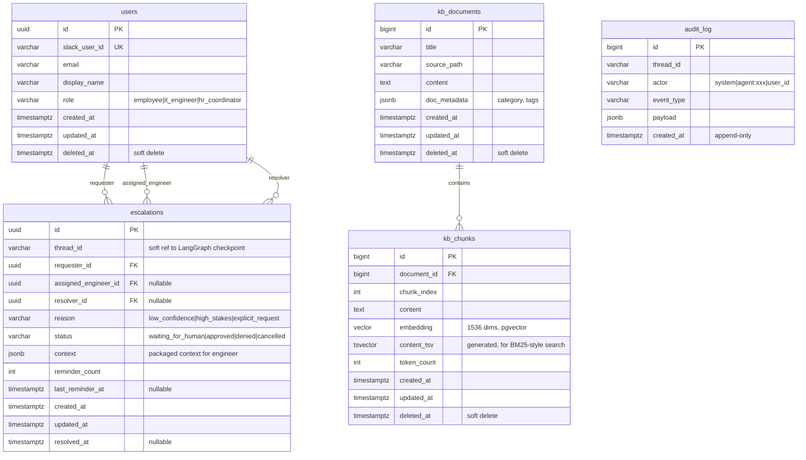

# Database Schema & State Design: IT Helpdesk Slack Assistant

**Version:** 1.0
**Date:** 2026-05-13
**Status:** Draft for capstone review
**Related documents:** [Solution Design Document](./02-solution-design.md), [ADR-004](./adr/adr-004-postgres-redis-split.md), [ADR-005](./adr/adr-005-pgvector.md)


## 1. Two Kinds of State

Questo sistema gestisce due categorie di stato distinte, possedute da soggetti 
diversi e governate da cicli di vita diversi. Confonderle è un errore di design 
comune; questo documento le tiene esplicitamente separate.

### 1.1 Business State (designed and owned by this project)

Dati relazionali classici che rappresentano il dominio di business:

- `users` — collegamento tra le identità Slack e i dipendenti interni
- `escalations` — i record delle escalation verso l'umano (human-in-the-loop)
- `kb_documents` / `kb_chunks` — i contenuti della knowledge base e i loro embedding
- `audit_log` — registro append-only delle azioni del sistema

Queste tabelle sono progettate in questo documento e la loro evoluzione è 
gestita tramite migrazioni **Alembic**.

### 1.2 Graph Execution State (owned by LangGraph)

Lo stato a runtime del grafo di agenti — su quale nodo l'esecuzione si è fermata, 
l'oggetto di stato di lavoro, la cronologia dei messaggi — è salvato dal 
**checkpointer `PostgresSaver` di LangGraph**. Queste tabelle sono create e 
gestite dal framework, non da questo progetto. Sono descritte nella Sezione 5 ma 
**non progettate qui**: progettarle manualmente duplicherebbe la responsabilità 
del framework e rischierebbe un disallineamento.

### 1.3 The Bridge Between Them

Lo stato di business e lo stato del grafo sono correlati tramite `thread_id` — 
un identificatore di tipo stringa legato a una conversazione Slack. Una riga 
`escalation` porta un `thread_id` che si correla a un checkpoint LangGraph, ma 
questo è un **riferimento debole** (una stringa correlabile), **non una foreign 
key imposta**. Non creiamo foreign key verso le tabelle gestite dal framework: 
accoppierebbe il nostro schema alla struttura interna di LangGraph e 
interferirebbe con la sua gestione indipendente del ciclo di vita.

## 2. Entity-Relationship Diagram



Le **tabelle di checkpoint di LangGraph** (`checkpoints`, `checkpoint_blobs`, 
`checkpoint_writes`, `checkpoint_migrations`) non sono mostrate — sono gestite 
dal framework (vedi Sezione 5).


## 3. Table Definitions (DDL)

Tutte le tabelle usano PostgreSQL 16. Sono richieste le estensioni `pgcrypto` 
(o `uuid-ossp`) e `vector`

### 3.1 Extensions

```sql
CREATE EXTENSION IF NOT EXISTS "pgcrypto";   -- gen_random_uuid()
CREATE EXTENSION IF NOT EXISTS "vector";     -- pgvector
```

### 3.2 users

```sql
CREATE TABLE users (
    id              UUID         PRIMARY KEY DEFAULT gen_random_uuid(),
    slack_user_id   VARCHAR(32)  NOT NULL UNIQUE,
    email           VARCHAR(320),
    display_name    VARCHAR(255),
    role            VARCHAR(32)  NOT NULL DEFAULT 'employee',
    created_at      TIMESTAMPTZ  NOT NULL DEFAULT now(),
    updated_at      TIMESTAMPTZ  NOT NULL DEFAULT now(),
    deleted_at      TIMESTAMPTZ
    -- I valori di 'role' sono validati nello strato applicativo (Python Enum /
    -- Pydantic). Il CHECK a livello di DB è stato omesso di proposito per
    -- flessibilità di evoluzione:
    -- CHECK (role IN ('employee', 'it_engineer', 'hr_coordinator'))
);
```

**Scopo:** collega un'identità Slack (`slack_user_id`) a un record di dipendente 
interno. Viene consultata a ogni richiesta in entrata per capire chi sta parlando.

**Note di design principali:**
- `id` è **UUID** — può comparire nei payload di Slack (per esempio 
  nell'assegnazione delle escalation); un identificatore non indovinabile evita 
  di esporre l'enumerazione degli utenti.
- `slack_user_id` è la chiave naturale dal lato di Slack; `UNIQUE` garantisce 
  un solo record interno per utente Slack.
- `role` esiste **per l'instradamento delle escalation, non per 
  l'autorizzazione**. La v1 non ha permessi per-utente (come da Charter); ma il 
  sistema deve sapere *quali* utenti sono ingegneri IT per instradare loro le 
  escalation.
- `deleted_at` (soft delete) — un dipendente che lascia l'azienda viene marcato 
  come inattivo, non cancellato, perché le `escalations` storiche lo referenziano 
  tramite foreign key.

### 3.3 escalations

```sql
CREATE TABLE escalations (
    id                     UUID         PRIMARY KEY DEFAULT gen_random_uuid(),
    thread_id              VARCHAR(255) NOT NULL,
    requester_id           UUID         NOT NULL REFERENCES users(id),
    assigned_engineer_id   UUID         REFERENCES users(id),
    resolver_id            UUID         REFERENCES users(id),
    reason                 VARCHAR(32)  NOT NULL,
    status                 VARCHAR(32)  NOT NULL DEFAULT 'waiting_for_human',
    context                JSONB        NOT NULL DEFAULT '{}'::jsonb,
    reminder_count         INTEGER      NOT NULL DEFAULT 0,
    last_reminder_at       TIMESTAMPTZ,
    created_at             TIMESTAMPTZ  NOT NULL DEFAULT now(),
    updated_at             TIMESTAMPTZ  NOT NULL DEFAULT now(),
    resolved_at            TIMESTAMPTZ
    -- Nessun deleted_at: le escalation non vengono mai cancellate
    -- (retention indefinita per audit).
    -- I valori di reason / status sono validati nello strato applicativo.
    -- CHECK a livello di DB omessi di proposito:
    -- CHECK (reason IN ('low_confidence','high_stakes','explicit_request'))
    -- CHECK (status IN ('waiting_for_human','approved','denied','cancelled'))
);

-- Impedisce la doppia escalation: al massimo una escalation aperta per
-- conversazione. Indice unique parziale — imposto solo per lo stato
-- 'waiting_for_human'.
CREATE UNIQUE INDEX uq_escalations_open_per_thread
    ON escalations (thread_id)
    WHERE status = 'waiting_for_human';
```

**Scopo:** registra ogni escalation verso l'umano — chi ha richiesto, perché, 
a chi è stata instradata, chi l'ha risolta, e il contesto completo passato 
all'ingegnere.

**Note di design principali:**
- `thread_id` è un **riferimento debole** al checkpoint LangGraph (Sezione 1.3) 
  — correlabile, non imposto come foreign key.
- Tre riferimenti separati a utenti: `requester_id` (chi ha chiesto), 
  `assigned_engineer_id` (a chi è stata instradata), `resolver_id` (chi l'ha 
  effettivamente risolta — può essere diverso da chi era assegnato).
- `context` è **JSONB** — il contesto preparato per l'ingegnere (testo della 
  richiesta originale, risultato della classificazione, l'azione che l'agente 
  stava per eseguire). JSONB perché la forma di questo payload varia e viene 
  letto come un tutt'uno, non interrogato campo per campo.
- L'**indice unique parziale** è il meccanismo di idempotenza descritto in 
  SDD §8.7 — rende impossibile la "doppia escalation per la stessa 
  conversazione" a livello di database, indipendentemente dalle race condition 
  a livello applicativo.
- `reminder_count` + `last_reminder_at` supportano il flusso del reminder 
  time-triggered (SDD §6.3); i reminder si fermano a 2 (decisione ADR / Charter).
- **Nessun `deleted_at`** — le escalation sono record di audit, mai cancellati. 
  Questo è più forte del soft delete.

### 3.4 kb_documents

```sql
CREATE TABLE kb_documents (
    id            BIGSERIAL    PRIMARY KEY,
    title         VARCHAR(512) NOT NULL,
    source_path   VARCHAR(1024),
    content       TEXT         NOT NULL,
    doc_metadata  JSONB        NOT NULL DEFAULT '{}'::jsonb,
    created_at    TIMESTAMPTZ  NOT NULL DEFAULT now(),
    updated_at    TIMESTAMPTZ  NOT NULL DEFAULT now(),
    deleted_at    TIMESTAMPTZ
);
```

**Scopo:** i documenti sorgente della knowledge base — testo completo più 
metadati.

**Note di design principali:**
- `id` è **BIGSERIAL** — identificatore puramente interno, non attraversa mai 
  un trust boundary; l'intero è più compatto come foreign key e più leggibile 
  in fase di debug.
- `content` contiene il documento completo; i chunk (3.5) sono derivati da esso.
- `doc_metadata` (JSONB) — categoria, tag, team proprietario, ecc. Flessibile 
  perché la forma dei metadati può evolvere.
- `deleted_at` (soft delete) — un documento può essere ritirato dalla 
  pubblicazione mantenendo la sua storia, e le query attive non si rompono a 
  metà esecuzione.


### 3.5 kb_chunks

```sql
CREATE TABLE kb_chunks (
    id            BIGSERIAL    PRIMARY KEY,
    document_id   BIGINT       NOT NULL REFERENCES kb_documents(id),
    chunk_index   INTEGER      NOT NULL,
    content       TEXT         NOT NULL,
    embedding     VECTOR(1536),
    content_tsv   TSVECTOR     GENERATED ALWAYS AS
                               (to_tsvector('english', content)) STORED,
    token_count   INTEGER,
    created_at    TIMESTAMPTZ  NOT NULL DEFAULT now(),
    updated_at    TIMESTAMPTZ  NOT NULL DEFAULT now(),
    deleted_at    TIMESTAMPTZ,

    UNIQUE (document_id, chunk_index)
);
```

**Scopo:** la rappresentazione in chunk ed embedded dei documenti della KB — 
l'unità di retrieval per il RAG.

**Note di design principali:**
- `embedding VECTOR(1536)` — tipo pgvector; **1536 dimensioni** corrisponde a 
  OpenAI `text-embedding-3-small`. Se il modello di embedding cambia, questa 
  dimensione cambia e servono una migrazione più un re-embedding.
- `content_tsv` è una **colonna generata** — PostgreSQL deriva automaticamente 
  il vettore di full-text search da `content`. Questo è il **lato keyword / tipo 
  BM25** della ricerca ibrida (ADR-006); la colonna `embedding` è il **lato 
  vettoriale**. La ricerca ibrida interroga entrambi e fonde i risultati.
- `UNIQUE (document_id, chunk_index)` — le posizioni dei chunk all'interno di un 
  documento sono uniche; il re-chunking sostituisce in modo pulito.
- `embedding` è nullable per permettere un inserimento in due fasi (prima il 
  testo del chunk, poi l'embedding in modo asincrono), anche se la v1 fa 
  l'embedding inline.

### 3.6 audit_log

```sql
CREATE TABLE audit_log (
    id           BIGSERIAL    PRIMARY KEY,
    thread_id    VARCHAR(255) NOT NULL,
    actor        VARCHAR(64)  NOT NULL,
    event_type   VARCHAR(64)  NOT NULL,
    payload      JSONB        NOT NULL DEFAULT '{}'::jsonb,
    created_at   TIMESTAMPTZ  NOT NULL DEFAULT now()
    -- Append-only: nessun updated_at, nessun deleted_at.
    -- Le righe vengono inserite, mai modificate o rimosse.
);
```

**Scopo:** un registro append-only di ciò che il sistema ha fatto — richiesta 
ricevuta, classificata, KB consultata, tool eseguito, escalation, risoluzione.

**Note di design principali:**
- **Append-only by design** — nessun `updated_at`, nessun `deleted_at`. Una 
  riga, una volta scritta, è immutabile. È questo che lo rende affidabile come 
  audit trail.
- `actor` identifica chi/cosa ha eseguito l'azione: `'system'`, 
  `'agent:supervisor'`, `'agent:action'`, oppure un id utente.
- `event_type` è un vocabolario controllato, validato nello strato applicativo.
- `payload` (JSONB) — dettagli specifici dell'evento; la forma varia per 
  `event_type`, quindi una colonna flessibile invece di tabelle per-evento.


## 4. JSONB Usage Rationale

Tre colonne usano `JSONB` (`escalations.context`, `kb_documents.doc_metadata`, 
`audit_log.payload`). È una scelta deliberata e limitata:

**Usato dove:** la forma del dato varia, e viene letto come un tutt'uno invece 
che filtrato campo per campo in SQL.

**Non usato dove:** qualsiasi cosa interrogata, messa in join o vincolata — 
quelle sono colonne vere e proprie (`status`, `reason`, `requester_id`, ecc.).

**Trade-off accettato:** JSONB sacrifica il rigore dello schema in cambio di 
flessibilità. La mitigazione è che tutti i payload JSONB sono validati da 
**modelli Pydantic** nello strato applicativo prima dell'inserimento — la 
struttura è imposta nel codice, semplicemente non nel database.

---

## 5. LangGraph Checkpoint Tables (Framework-Managed)

Il checkpointer `PostgresSaver` di LangGraph crea e gestisce le proprie tabelle, 
tipicamente: `checkpoints`, `checkpoint_blobs`, `checkpoint_writes`, 
`checkpoint_migrations`. La struttura esatta dipende dalla versione di LangGraph.

**Queste non sono progettate in questo documento e non sono gestite dalle nostre 
migrazioni Alembic.** Vengono create tramite il metodo `setup()` del 
checkpointer all'avvio dell'applicazione.

**Perché non le gestiamo noi:**
- Progettarle manualmente duplicherebbe la responsabilità del framework
- Creare foreign key verso di esse accoppierebbe il nostro schema agli interni 
  di LangGraph
- LangGraph evolve il proprio schema di checkpoint tra le versioni; lasciare 
  che il framework possieda le proprie migrazioni evita il disallineamento

**Il confine:** le nostre migrazioni Alembic gestiscono *solo* le cinque tabelle 
di business sopra. Il `setup()` di LangGraph gestisce le sue tabelle di 
checkpoint. Coesistono nello stesso database PostgreSQL, correlate tramite 
`thread_id`, ma sono migrate in modo indipendente.


## 6. Indexes & Rationale

Oltre alle chiavi primarie e ai vincoli già mostrati:

```sql
-- users: consultata tramite Slack ID a ogni richiesta in entrata
CREATE INDEX idx_users_slack_user_id ON users (slack_user_id);
-- (già UNIQUE, ma esplicitato per chiarezza sul pattern di accesso)

-- escalations: trovare l'escalation di una data conversazione
CREATE INDEX idx_escalations_thread_id ON escalations (thread_id);

-- escalations: la coda dei pendenti di un ingegnere
CREATE INDEX idx_escalations_assigned_engineer
    ON escalations (assigned_engineer_id)
    WHERE status = 'waiting_for_human';

-- escalations: lo scheduler scansiona le escalation pendenti per i reminder
CREATE INDEX idx_escalations_status ON escalations (status);

-- kb_chunks: lookup tramite foreign key (i chunk di un documento)
CREATE INDEX idx_kb_chunks_document_id ON kb_chunks (document_id);

-- kb_chunks: ricerca per similarità vettoriale (HNSW — recall/velocità
-- migliori di IVFFlat su dataset piccoli-medi, senza fase di training)
CREATE INDEX idx_kb_chunks_embedding
    ON kb_chunks USING hnsw (embedding vector_cosine_ops);

-- kb_chunks: full-text search (il lato keyword della ricerca ibrida)
CREATE INDEX idx_kb_chunks_content_tsv
    ON kb_chunks USING gin (content_tsv);

-- audit_log: query su intervalli temporali ("cosa è successo in questa finestra")
CREATE INDEX idx_audit_log_created_at ON audit_log (created_at);

-- audit_log: cronologia per conversazione
CREATE INDEX idx_audit_log_thread_id ON audit_log (thread_id);
```

**Scelte sugli indici che vale la pena difendere:**
- **HNSW invece di IVFFlat** per l'indice vettoriale — HNSW non richiede una 
  fase di training, dà recall/latenza migliori alla nostra scala e gestisce bene 
  gli inserimenti incrementali. IVFFlat sarebbe considerato solo a una scala 
  molto più grande, dove la dimensione dell'indice conta.
- **GIN su `content_tsv`** — l'indice standard di PostgreSQL per il full-text 
  search; abilita il lato keyword della ricerca ibrida.
- **Indici parziali** (`WHERE status = 'waiting_for_human'`) — le query dello 
  scheduler e della coda dell'ingegnere riguardano solo le escalation aperte; un 
  indice parziale è più piccolo e veloce di uno completo.

## 7. The `updated_at` Trigger

`updated_at` è mantenuto da un **trigger del database**, non solo dall'ORM.

```sql
CREATE OR REPLACE FUNCTION set_updated_at()
RETURNS TRIGGER AS $$
BEGIN
    NEW.updated_at = now();
    RETURN NEW;
END;
$$ LANGUAGE plpgsql;

-- Applicato a ogni tabella che ha updated_at:
CREATE TRIGGER trg_users_updated_at
    BEFORE UPDATE ON users
    FOR EACH ROW EXECUTE FUNCTION set_updated_at();

CREATE TRIGGER trg_escalations_updated_at
    BEFORE UPDATE ON escalations
    FOR EACH ROW EXECUTE FUNCTION set_updated_at();

CREATE TRIGGER trg_kb_documents_updated_at
    BEFORE UPDATE ON kb_documents
    FOR EACH ROW EXECUTE FUNCTION set_updated_at();

CREATE TRIGGER trg_kb_chunks_updated_at
    BEFORE UPDATE ON kb_chunks
    FOR EACH ROW EXECUTE FUNCTION set_updated_at();
```

**Perché un trigger del DB e non solo l'ORM:** se una riga viene modificata al 
di fuori dell'ORM — una correzione manuale, una migrazione, un futuro secondo 
servizio — `updated_at` si aggiorna comunque. La logica solo-ORM garantisce la 
correttezza solo per le scritture che passano per quello specifico ORM. Il 
database è l'ultima linea di difesa per questo invariante.

## 8. Migration Strategy

**Strumento:** Alembic, configurato in modalità async (in linea con il setup 
async di SQLAlchemy).

**Principi:**
- Ogni modifica allo schema è una migrazione versionata e revisionata — nessun 
  `ALTER` manuale in nessun ambiente.
- Le migrazioni sono **orientate in avanti**; ognuna ha un `downgrade()`, ma il 
  rollback in produzione è trattato come eccezionale.
- La migrazione iniziale crea: le estensioni, le cinque tabelle di business, gli 
  indici, la funzione di trigger e i trigger.
- **Confine con LangGraph:** le migrazioni Alembic coprono *solo* le cinque 
  tabelle di business. Le tabelle di checkpoint di LangGraph sono create dal 
  `setup()` del framework all'avvio e sono esplicitamente fuori dallo scope di 
  Alembic. Questa separazione è documentata affinché un futuro manutentore non 
  cerchi di "correggere" l'apparente lacuna.

**Modifiche alla dimensione dell'embedding:** se il modello di embedding cambia, 
la dimensione di `kb_chunks.embedding` cambia. Questa è una migrazione **più** 
un job di re-embedding per tutti i chunk esistenti — segnalato qui perché è 
l'unica modifica allo schema che non è puramente strutturale.


## 9. Relationship to the Rest of the SDD

| Questo documento definisce | Consumato da |
|---|---|
| Tabella `users` | Slack Handler (risoluzione identità), Escalation Agent (instradamento) — SDD §5.5 |
| Tabella `escalations` | Escalation Agent, Scheduler — SDD §6.2, §6.3 |
| `kb_documents` / `kb_chunks` | Modulo RAG — SDD §4.4, ADR-006 |
| Tabella `audit_log` | Componente Observability — SDD §8.3 |
| Riferimento debole tramite `thread_id` | Il ponte verso i checkpoint LangGraph — SDD §4.3 |
| Scelte sugli indici | Caratteristiche di performance referenziate nella Runtime View — SDD §6 |

